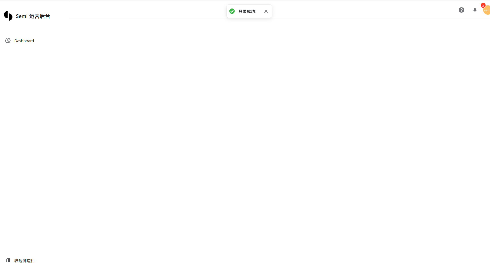

# RELEASE ADMIN

基于抖音reactUI [semi desgin](https://semi.design/zh-CN) + vite4 + typescript + react18 + zustand + tailwindcss 构建

## 功能

- [√] 封装generalHttpHandler高阶函数来统一处理grpc-ts的http/json请求
- [√] 飞书扫码登录页
- [√] 通用中台布局

## 开发

1. clone 项目进入工程目录

2. 安装依赖
npm i
3. 生成proto3 api ts代码
buf generate
4. 开发模式运行项目
npm run dev
5. caddy服务镜像构建
make imagebuildpublish
### 使用飞书扫码免密登录
1. 开放登录页，仅本公司的飞书组织成员可以正常扫

2. 公司人员手机飞书app确认授权

3. 授权通过则准入中台页面

